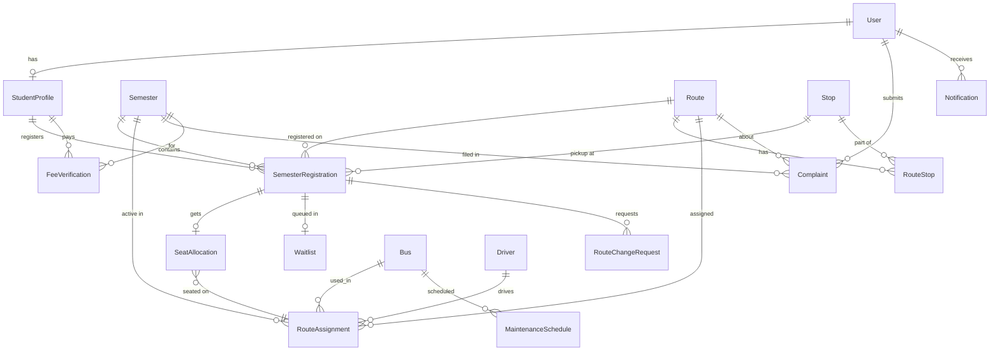

# FAST Transport Management System — Database Schema Design (v2)

## 1. Overview

This document presents the **finalized** database schema design for the **FAST Transport Management System**. The schema is designed for **PostgreSQL** and maps to **Django models**. It covers all core modules identified in the project proposal.

> [!IMPORTANT]
> **Schedule**: Mon–Thu only. Morning pickup: 6:00 AM (first stop) → 8:00 AM (university). Evening drop-off: 4:00 PM (university) → 6:00 PM (last stop). Multiple buses can operate on a single route.

> [!NOTE]
> All tables use Django conventions: auto-incrementing `id` as primary key, and `created_at` / `updated_at` timestamps where applicable.

---

## 2. Entity Identification (from the Proposal)

Based on the project proposal, the following entities and modules were identified:

| Module | Key Entities |
|---|---|
| **Registration** | User, Student, Semester, SemesterRegistration |
| **Route Management** | Route, Stop, RouteStop (ordering stops on a route) |
| **Bus & Driver** | Bus, Driver, RouteAssignment (bus+driver → route) |
| **Seat Allocation & Waitlist** | SeatAllocation, Waitlist |
| **Complaint Management** | Complaint |
| **Maintenance** | MaintenanceSchedule |
| **Fee Tracking** | FeeVerification (simulated ERP) |
| **Analytics** | No separate table — derived from existing data |

---

## 3. Schema Design — Step by Step

### Step 1: User & Authentication

Django provides a built-in `User` model. We extend it with role-based access.

```
┌──────────────────────────────┐
│          User (Django)       │
├──────────────────────────────┤
│ id           PK              │
│ username     VARCHAR UNIQUE  │
│ email        VARCHAR UNIQUE  │
│ password     VARCHAR (hashed)│
│ first_name   VARCHAR         │
│ last_name    VARCHAR         │
│ role         ENUM(student,   │
│              admin)          │
│ is_active    BOOLEAN         │
│ created_at   TIMESTAMP       │
│ updated_at   TIMESTAMP       │
└──────────────────────────────┘
```

> [!TIP]
> Use Django's `AbstractUser` to add the `role` field directly, or create a separate `Profile` model with a OneToOne link. Using `AbstractUser` is simpler for this project.

---

### Step 2: Student Profile

Stores FAST-specific student info linked to the User.

```
┌──────────────────────────────┐
│        StudentProfile        │
├──────────────────────────────┤
│ id           PK              │
│ user_id      FK → User       │ (OneToOne)
│ roll_number  VARCHAR UNIQUE  │ e.g. "K230551"
│ department   VARCHAR         │ e.g. "CS", "SE", "AI"
│ batch        VARCHAR         │ e.g. "2023"
│ phone        VARCHAR         │
│ address      TEXT            │
│ created_at   TIMESTAMP       │
│ updated_at   TIMESTAMP       │
└──────────────────────────────┘
```

---

### Step 3: Semester

A time-bounded academic period. All registrations, fees, and records are tied to a semester.

```
┌──────────────────────────────┐
│           Semester           │
├──────────────────────────────┤
│ id           PK              │
│ name         VARCHAR         │ e.g. "Spring 2026"
│ year         INTEGER         │
│ term         ENUM(Spring,    │
│              Summer, Fall)   │
│ start_date   DATE            │
│ end_date     DATE            │
│ is_active    BOOLEAN         │ only one active at a time
│ registration_open  BOOLEAN   │
│ created_at   TIMESTAMP       │
└──────────────────────────────┘
```

---

### Step 4: Route & Stop

Routes represent bus lines. Stops are physical locations. A route has many ordered stops, each with **morning pickup** and **evening drop-off** ETAs.

```
┌──────────────────────────────┐        ┌──────────────────────────────┐
│           Route              │        │           Stop               │
├──────────────────────────────┤        ├──────────────────────────────┤
│ id           PK              │        │ id           PK              │
│ name         VARCHAR         │        │ name         VARCHAR         │
│ description  TEXT (nullable) │        │ latitude     DECIMAL(9,6)    │
│ is_active    BOOLEAN         │        │ longitude    DECIMAL(9,6)    │
│ created_at   TIMESTAMP       │        │ address      TEXT (nullable) │
│ updated_at   TIMESTAMP       │        │ created_at   TIMESTAMP       │
└──────────────────────────────┘        └──────────────────────────────┘

             ┌──────────────────────────────────────┐
             │           RouteStop                  │ (junction / ordering table)
             ├──────────────────────────────────────┤
             │ id              PK                   │
             │ route_id        FK → Route           │
             │ stop_id         FK → Stop            │
             │ stop_order      INTEGER              │ sequence on the route
             │ morning_eta     TIME                 │ e.g. 06:15 (pickup time)
             │ evening_eta     TIME                 │ e.g. 05:45 (dropoff time)
             └──────────────────────────────────────┘
             UNIQUE(route_id, stop_order)
             UNIQUE(route_id, stop_id)
```

---

### Step 5: Bus & Driver

> [!NOTE]
> **Driver** is a standalone entity — drivers do **not** log in. Their data is entered by admins.

```
┌──────────────────────────────┐        ┌──────────────────────────────┐
│            Bus               │        │          Driver              │
├──────────────────────────────┤        ├──────────────────────────────┤
│ id           PK              │        │ id           PK              │
│ bus_number   VARCHAR UNIQUE  │        │ name         VARCHAR         │
│ capacity     INTEGER         │        │ cnic         VARCHAR UNIQUE  │
│ model        VARCHAR         │        │ license_no   VARCHAR UNIQUE  │
│ is_active    BOOLEAN         │        │ phone        VARCHAR         │
│ created_at   TIMESTAMP       │        │ address      TEXT (nullable) │
│ updated_at   TIMESTAMP       │        │ is_available BOOLEAN         │
└──────────────────────────────┘        │ created_at   TIMESTAMP       │
                                        │ updated_at   TIMESTAMP       │
                                        └──────────────────────────────┘
```

---

### Step 6: Route Assignment (Bus + Driver → Route per Semester)

Links a bus and driver to a route for a semester. **Multiple buses** can be assigned to the same route.

```
┌──────────────────────────────────────┐
│         RouteAssignment              │
├──────────────────────────────────────┤
│ id           PK                      │
│ route_id     FK → Route              │
│ bus_id       FK → Bus                │
│ driver_id    FK → Driver             │
│ semester_id  FK → Semester           │
│ is_active    BOOLEAN                 │
│ created_at   TIMESTAMP               │
└──────────────────────────────────────┘
UNIQUE(route_id, bus_id, semester_id)  -- a bus assigned to a route once per semester
```

---

### Step 7: Semester Registration (Student registers for transport)

This is the **core registration** table. A student registers for transport each semester, picks a route and stop.

```
┌──────────────────────────────────────┐
│      SemesterRegistration            │
├──────────────────────────────────────┤
│ id           PK                      │
│ student_id   FK → StudentProfile     │
│ semester_id  FK → Semester           │
│ route_id     FK → Route              │
│ stop_id      FK → Stop              │
│ status       ENUM(registered,        │
│              waitlisted, cancelled)  │
│ registered_at TIMESTAMP              │
│ updated_at   TIMESTAMP               │
└──────────────────────────────────────┘
UNIQUE(student_id, semester_id)  -- one registration per student per semester
```

---

### Step 8: Seat Allocation

Tracks assigned **numbered seats** on a specific bus. Seat numbers range from 1 to the bus's `capacity`.

```
┌──────────────────────────────────────┐
│         SeatAllocation               │
├──────────────────────────────────────┤
│ id              PK                   │
│ registration_id FK → SemesterReg.    │ (OneToOne)
│ route_assignment_id FK → RouteAssignment │ identifies the specific bus
│ seat_number     INTEGER              │ 1 to bus.capacity
│ allocated_at    TIMESTAMP            │
└──────────────────────────────────────┘
UNIQUE(registration_id)
UNIQUE(route_assignment_id, seat_number)  -- no duplicate seats on same bus
```

> [!IMPORTANT]
> When a student cancels, their `SeatAllocation` is deleted and the next student on the waitlist (ordered by `position`) is promoted and assigned the freed seat automatically.

---

### Step 9: Waitlist

Maintains a queue of students waiting for a seat on a full route. ✅ **Kept as a separate table** for explicit queue position control.

```
┌──────────────────────────────────────┐
│           Waitlist                   │
├──────────────────────────────────────┤
│ id              PK                   │
│ registration_id FK → SemesterReg.    │ (OneToOne)
│ position        INTEGER              │ queue position (1 = next in line)
│ added_at        TIMESTAMP            │
└──────────────────────────────────────┘
```

> [!TIP]
> When a seat opens, the student at `position=1` is promoted: a `SeatAllocation` is created and all remaining positions are decremented by 1.

---

### Step 10: Route Change Request

Students can request to switch routes.

```
┌──────────────────────────────────────┐
│       RouteChangeRequest             │
├──────────────────────────────────────┤
│ id                PK                 │
│ registration_id   FK → SemesterReg.  │
│ current_route_id  FK → Route         │
│ requested_route_id FK → Route        │
│ requested_stop_id FK → Stop          │
│ status            ENUM(pending,      │
│                   approved, rejected)│
│ admin_remarks     TEXT (nullable)    │
│ requested_at      TIMESTAMP          │
│ resolved_at       TIMESTAMP (null)   │
└──────────────────────────────────────┘
```

---

### Step 11: Complaint Management

```
┌──────────────────────────────────────┐
│          Complaint                   │
├──────────────────────────────────────┤
│ id              PK                   │
│ submitted_by    FK → User            │
│ semester_id     FK → Semester        │
│ route_id        FK → Route (nullable)│
│ category        ENUM(delay, driver,  │
│                 route, vehicle,      │
│                 other)               │
│ subject         VARCHAR              │
│ description     TEXT                 │
│ status          ENUM(open,           │
│                 in_progress,         │
│                 resolved, closed)    │
│ priority        ENUM(low, medium,    │
│                 high)                │
│ admin_response  TEXT (nullable)      │
│ resolved_by     FK → User (nullable) │
│ created_at      TIMESTAMP            │
│ resolved_at     TIMESTAMP (nullable) │
└──────────────────────────────────────┘
```

---

### Step 12: Maintenance Scheduling

```
┌──────────────────────────────────────┐
│      MaintenanceSchedule             │
├──────────────────────────────────────┤
│ id              PK                   │
│ bus_id          FK → Bus             │
│ maintenance_type ENUM(routine,       │
│                 repair, inspection)  │
│ description     TEXT                 │
│ scheduled_date  DATE                 │
│ completed_date  DATE (nullable)      │
│ status          ENUM(scheduled,      │
│                 in_progress,         │
│                 completed)           │
│ cost            DECIMAL(10,2) (null) │
│ created_by      FK → User           │
│ created_at      TIMESTAMP            │
│ updated_at      TIMESTAMP            │
└──────────────────────────────────────┘
```

---

### Step 13: Fee Verification (Simulated ERP)

Tracks whether a student's transport fee is verified for a semester.

```
┌──────────────────────────────────────┐
│        FeeVerification               │
├──────────────────────────────────────┤
│ id              PK                   │
│ student_id      FK → StudentProfile  │
│ semester_id     FK → Semester        │
│ amount          DECIMAL(10,2)        │
│ is_verified     BOOLEAN DEFAULT FALSE│
│ verified_by     FK → User (nullable) │
│ challan_number  VARCHAR (nullable)   │ simulated payment ref
│ verified_at     TIMESTAMP (nullable) │
│ created_at      TIMESTAMP            │
└──────────────────────────────────────┘
UNIQUE(student_id, semester_id)
```

---

## 4. Entity Relationship Diagram



---

## 5. Table Summary

| # | Table | Purpose |
|---|---|---|
| 1 | `User` | Authentication + role (student, admin) |
| 2 | `StudentProfile` | FAST-specific student details |
| 3 | `Semester` | Academic periods |
| 4 | `Route` | Bus routes |
| 5 | `Stop` | Physical pickup/dropoff locations |
| 6 | `RouteStop` | Ordered stops per route with morning/evening ETAs |
| 7 | `Bus` | Vehicle inventory with seat capacity |
| 8 | `Driver` | Standalone driver records (no login) |
| 9 | `RouteAssignment` | Bus + Driver → Route per Semester (multiple buses per route) |
| 10 | `SemesterRegistration` | Student transport registration per semester |
| 11 | `SeatAllocation` | Numbered seat assignments on specific buses |
| 12 | `Waitlist` | Explicit queue with position ordering |
| 13 | `RouteChangeRequest` | Student route change requests |
| 14 | `Complaint` | Complaint tickets with categories & priority |
| 15 | `MaintenanceSchedule` | Bus maintenance records |
| 16 | `FeeVerification` | Simulated ERP fee tracking |
| 17 | `Notification` | In-app notifications for all users |

**Total: 17 tables**

---

### Step 14: Notification

In-app notifications for waitlist promotions, complaint status updates, and general announcements.

```
┌──────────────────────────────────────┐
│          Notification                │
├──────────────────────────────────────┤
│ id              PK                   │
│ user_id         FK → User            │
│ title           VARCHAR              │
│ message         TEXT                 │
│ type            ENUM(waitlist,       │
│                 complaint, seat,     │
│                 registration,        │
│                 general)             │
│ is_read         BOOLEAN DEFAULT FALSE│
│ created_at      TIMESTAMP            │
└──────────────────────────────────────┘
```

---

## 6. Finalized Design Decisions

| # | Decision | Resolution |
|---|---|---|
| 1 | Waitlist table | ✅ Separate table with explicit `position` field |
| 2 | Seat numbering | ✅ Numbered 1 to `bus.capacity`, unique per bus |
| 3 | Multiple buses per route | ✅ `RouteAssignment` allows many buses per route per semester |
| 4 | Driver login | ✅ Standalone — no User FK, data entered by admin |
| 5 | Schedule / ETAs | ✅ `morning_eta` and `evening_eta` on `RouteStop` (Mon–Thu, 6AM–8AM / 4PM–6PM) |
| 6 | Notifications | ✅ Added `Notification` table for waitlist, complaint, and seat updates |
| 7 | User roles | `student` and `admin` only (driver removed from roles) |
